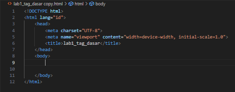
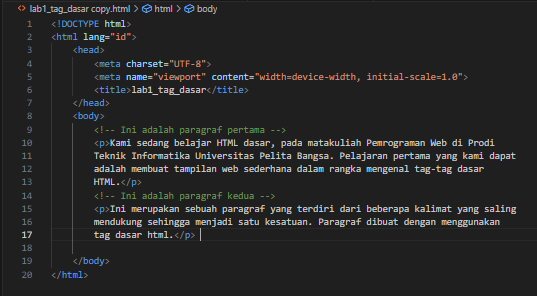

# Lab1Web / Belajar Web HTML

## - Pertama buat kerangka html

* dengan isi tambahan.

## - Menambah teks paragraf dengan &lt;p&gt; di bagian dalam &lt;body&gt;

* Hasilnya ada dua baris teks paragraf dan ada jarak karena di buat masing-masing.
### Menambahkan atribut align="" di dalam &lt;p&gt; yang isinya bisa (center, justify, left dan right)

* Teks justify.

 

* Teks center.

* Teks left dan right.

## Menambah judul dengan &lt;h1&gt;-&lt;h6&gt; atau header dan semakin besar angka semakin kecil teks

* Hasil tampilan &lt;h1&gt; dan &lt;h2&gt;, terlihat perbedaan ukurannya.

## Menambahkan format ke dalam teks

* &lt;mark&gt; untuk menandai teks.

* &lt;b&gt; untuk menebalkan teks (bold) dan hampir sama juga dengan &lt;strong&gt;.

* &lt;i&gt; untuk memiringkan teks (italic) dan hampir sama juga dengan &lt;em&gt;.

* &lt;ins&gt; untuk garisbawahi teks.

* dan contoh lainnya.

* &lt;del&gt; untuk garis tengah pada teks.

* &lt;sub&gt; untuk teks kecil di bawah dan &lt;sup&gt; teks kecil di atas.

* &lt;small&gt; untuk memperkecil teks.

## Menambahkan gambar, &lt;img&gt; untuk format gambar, "src" untuk lokasi tempat menyimpan gambarnya dan "title" menandai judul pada gambar saat cursor di arahkan pada gambar dan ada juga "alt" untuk menandakan dengan teks apa tampilan gambar kalau gambar tersebut rusak/tidak tapil

* Contoh tampilan web dan contoh kalau img rusak dan akan tergantikan dengan "alt" atau deskripsi.

 

* Untuk mengatur ukuran gambar agar tidak terlalu besar menggunakan "width".

* Jadi tampilan gambar mengecil.

## Menambahkan hyperlink di letakan di bagian atas dengan &lt;nav&gt; dan &lt;hr&gt; untuk garis bawah, ada juga &lt;br&gt; untuk membuat garis baru
* Berisi lokasi halaman dasar, halaman2 dan source ke google. 

* Contoh halaman dasar dan halaman ke dua

  

# Jawab Pertanyaan Berikut  
1. Lakukan perubahan pada kode sesuai dengan keinginan anda, amati perubahannya adakah error ketika terjadi kesalahan penulisan tag? 
    * Tidak ada karena tidak seperti pemograman yang sangat sensitif ketika ada bagian kode yang terlewat atau typo, karena html langsung menampilkan apaadanya walaupun kode bisa dibilang error/typo, html fokus pada struktur konten bukan logika.
2. Apa perbedaan dari tag &lt;p&gt; dengan tag &lt;br&gt;, berikan penjelasannya! 
    * &lt;p&gt; digunakan untuk teks paragraf seperti digunakan untuk satu blok teks dengan tag awal dan penutup &lt;p&gt;&lt;/p&gt;, sedangkan &lt;br&gt; digunakan umtuk membuat baris baru ke bawah seperti memotong teks ke bawah dan hanya mempunyai tag awal saja. 
3. Apa perbedaan atribut title dan alt pada tag &lt;img&gt;, berikan penjelasannya! 
    * Title pada &lt;img&gt; digunakan untuk tag nama pada gambar ketika kursor di arahkan ke gambarnya, sedangkan alt adalah teks sama seperti title atau juga deskripsi, tapi digunakan sebagai pengganti &lt;img&gt; ketika gambar rusak untuk mengetahui tampilan gambar tersebut yang digantikan dengan teks deskripsi singkat.
4. Untuk mengatur ukuran gambar, digunakan atribut width dan height. Agar tampilan gambar proporsional sebaiknya kedua atribut tersebut diisi semua atau tidak? Berikan penjelasannya! 
    * Tergantung ukuran gambarnya apakah hanya meperkecil, memperbesar atau mengatur bentuk ukurannya, width digunakan untuk lebar gambar (horizontal), sedangkan height untuk tingginya (vertikal). dan untuk hanya mengatur ukuran gambar saja pilih salah satu karena fungsinya hampir sama kalau dipakai untuk perbesar atau perkecil gambar, sedangkan kalau digunakan dua-duanya itu untuk mengatur bentuk gambar. jadi untuk mengatur ukuran gambar pilihlah salah satu saja.
5. Pada link tambahkan atribut target dengan nilai atribut bervariasi ( _blank, _self, _top, _parent ), apa yang terjadi pada masing-masing nilai antribut tersebut? 
    * (_blank) digunakan untuk ketika mengklik link dengan atribut tersebut, otomatis akan berpindah tab atau halaman dari halaman link tersebut di klik.
    * (_self) digunakan untuk ketika mengklik link dengan atribut tersebut, akan tetap di halaman tersebut tanpa berpindah tab atau halaman.
    * (_top) hampir sama dengan self hanya tampilan halaman di buka secara penuh atau fullscreen (menghapus semua frame/iframe).
    * (_parent) membuka link di parent frame (bingkai induk) dari sebuah iframe, jika tidak ada bingkai induk yang ditemukan halaman akan dibuka di bingkai yang sama, sama seperti (_self).